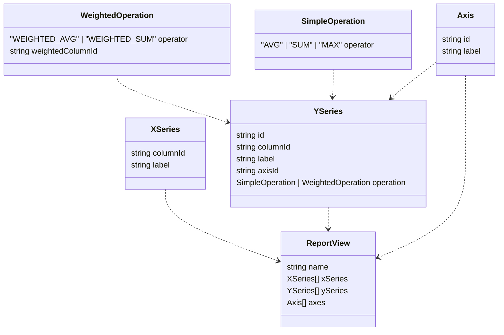

[//]: # (stable version due 17/02)

# Breaking down forms

This post is about breaking down large Angular forms into smaller forms managed by multiple component.  
It assumes familiarity with [Angular Reactive forms](https://angular.io/guide/reactive-forms).  
This is not a repeat of the excellent presentation from [Kara Erickson](https://www.youtube.com/watch?v=CD_t3m2WMM8), but an application of it.  

> :info: While looking into a bug I had I ran into [ngx-sub-form](https://www.npmjs.com/package/ngx-sub-form).
> At a glance it seems very similar to my approach, but purpose built as a nice standard library.
> I haven't had time to check it out, usability-wise nor security-wise; 

> :info: In this article I'm using Angular's new TypedForms (since v14).  
> When we originally wrote the code, we were still on Angular 13.  
> Because of that, we declared custom types for typed forms ourselves.  
> Admittedly, our code is still using those, and I haven't had many chances to use the new official ones yet, so you may find some inconsistencies.   
> You can find our type declaration [here](./typed-forms-for-angular-before-14/typed-forms.model.ts).   

## Background
We have a feature in our application where a user can generate custom graphs from existing datasets.  
The user defines which columns to show as Y values, what data to group it by as X values, how to aggregate it (average, max, etc), etc.

For example, if the data is: 

| age | gender |
|-----|--------|
| 25  | M      |
| 64  | F      |
| 42  | F      |

The user can request to see the average age (Y), grouped by gender (X)

[//]: # (TODO insert result graph)


As this feature was developed from a seed of an idea to an MVP, the form to define what the user wants
grew, changed drastically and hurriedly, got partially refactored, grew and changed drastically again, was partially
refactored again, had some hurried critical bug fixes patched here and there ...

In the end it was a mess of spaghetti code, riddled with bugs, where each small bug fix or feature adjustment required
hours of logic tracing and large rewrites. Any two changes would almost always conflict with each other.

So we did what everyone who deals with such code dreams of doing: we took a step back and rewrote the whole thing.  
Not from scratch - we wanted to keep most of the backend business logic - but pretty close. 

[//]: # (TODO _We still had to be mostly compatible with existing back code ..._)

Here's an extremely simplified version of the data structure we decided on:



```ts
// Main parent object
interface ReportView {
  name: string;
  xSeries: XSeries[];
  ySeries: YSeries[];
  axes: Axis[];
}

// Represents groups
interface XSeries {
  columnId: string;
  label: string;
}

// Represents aggregated values
interface YSeries {
  id: string;
  columnId: string;
  label: string;
  axisId: Axis["id"]; // == string
  operation: SimpleOperation | WeightedOperation;
}

interface Axis {
  id: string;
  label: string;
}

interface SimpleOperation {
    operator: "AVG" | "SUM" | "MAX"; // COUNT, etc.
}

interface WeightedOperation {
    operator: "WEIGHTED_AVG" | "WEIGHTED_SUM";
    weightedColumnId: string;
}
```

and an example value, requesting to show the average age by gender:
```json
{
  "name": "my first view",
  "data": {
    "xSeries": [{
        "columnId": "1",
        "label": "gender"
    }],
    "ySeries": [{
        "columnId": "2",
        "label": "age (AVG)",
        "operation": {
            "operator": "AVG"
        },
        "axisId": "1"
    }]
  },
  "options": {
    "axes": [{
      "id": "1",
      "label": "age (AVG)"
    }]
  }
}
```

[//]: # (TODO insert abstract sketch of UI \(lo-fi\))

## The problem
The final data structure is very large.
There are many validation constraints, as well as behavioural constraints. Some of those were conditional, and some depending on other parts of the form.
A single Angular form was incredibly unwieldy, and hard to break over multiple components.

## Solution: break it down

Based on [the talk by Kara Erickson](https://www.youtube.com/watch?v=CD_t3m2WMM8),
we created custom form Components for different sections, roughly corresponding to the interface definitions: an AxisFormComponent, XSeriesFormComponent, etc.
with the component "higher up the tree" using the "leaf" components.  
i.e DataFormComponent uses YSeriesFormComponent, which itself uses OperationFormComponent, etc. 


### How:

Let's first discuss what we _didn't_ do: just pass the form controls as `@Inputs`.  
We have a few components like that in our app. 
It's a perfectly OK solution for simple cases, like a name input with some specific styling and basic error messages:  

```ts
@Component({
  template: `
    <div class="container">
      <label>
        <span class="label-text">Name:</span>
        <input [formControl]="nameControl">
      </label>
      <span class="error" *ngIf="nameControl.hasError('required')">Name cannot be empty</span>
    </div>
  `
  // ...
})
class NameFormComponent {
  @Input()
  nameControl!: FormControl<string>;
}
```

The main drawback of form controls as inputs is that it keeps the task of creating the form controls in the "root" component.  
That includes all the logic of initial values, validation, subscriptions to `control.valueChanges`, etc.
We wanted to split the logic as much as possible. Having all the logic internal to the different components is the easiest to reason about.

We went with [what Kara Erickson refers to as a "Composite ControlValueAccessor"](https://www.youtube.com/watch?v=CD_t3m2WMM8&t=1565).

This is a bit tricky: Each sub form would have an internal form, separate from the one in the parent component.  
It would then sync the 2 forms with `ControlValueAccessor`.  
This will make more sense soon, I promise.

> :info: [ControlValueAccessor](https://angular.io/api/forms/ControlValueAccessor) is an interface for components.  
> With it, we define how a component can manage a FormControl given through the template.  
> For example, Angular Material’s MatSelect is a ControlValueAccessor, so we can give it a FormControl like so:
> ```
> <mat-select [formControl]=”myFormControl”>...
> ```


To make things easy, we created an `AbstractSubFormComponent`, so every new FormComponent will only need to define how it's internal form is created:

[example](./SubForm-address-example.md)

**Notice:** in `PersonForm` we only create a simple `FormControl` for `address`, and in `AddressFormComponent` we create a _separate_ `FormGroup`.
The validation and default values are in `AddressFormComponent`.

Changes to address are contained within it's component.  
If I want to refactor the cities to an `enum`, or add validation to the `street` based on city, I can do that fairly easily.
At the same time another dev can add more fields to `person` (email, date of birth ...), without any conflict.  
Obviously `AdressFormComponent` is easily reusable.

## Creating AbstractSubFormComponent

`AbstractSubFormComponent` defines implementation for `ControlValueAccessor`, requiring an internal `form` is set.
We'll make it generic, for more helpful typing.

Let's start with the skeleton
```ts
export abstract class AbstractSubFormComponent<T> implements ControlValueAccessor {
    protected form: AbstractControl<T>;
}
```

Great! Now let's implement `ControlValueAccessor`, step-by-step.
We will need to implement:

 - [writeValue](#writevalue)
 - [registerOnChange](#registerOnChange)
 - [registerOnTouched](#registerOnTouched)
 - [setDisabledState](#setDisabledState)

### `writeValue()`
`writeValue()` is called whenever the form control value changes in the **parent** component (`PersonFormComponent`), starting with the initial value.  

So all we need to do is set the value on the form:

```ts
writeValue(value: T): void {
  this.form.setValue(value);
}
```


#### Problem #1: lifecycle order

`writeValue()` is called before `ngOnInit()`, but in our app we initialize forms in `ngOnInit()`.  
OK, simple: until we initialize the form, we register any written values in a private field.
We then need to ensure that when a subclass initialize the form's value, it uses this value as the default one.

One more thing: the parent is able to specify an initial value, but it shouldn't have to.   
The SubFormComponent should define defaults.  
It should be possible for the parent to simply `address: new FormControl<Address>()`.

We're going to be strict and control the form initialization ourselves:

```ts
abstract class AbstractSubFormComponent<T> implements ControlValueAccessor, OnInit {
    initialValue: T | null;
    
    protected abstract setForm(intialValue: T | null);

    writeValue(value: T | null): void {
        if (this.form) {
            this.form.setValue(value);
        } else {
            this.initialValue = this.initialValue;
        }
    }
    
    ngOnInit(): void {
        this.setForm(this.initialValue);
    }
}
```

This is what you can see in [the Address example](./SubForm-address-example.md) 

#### Problem #2: ChangeDetectionStrategy.OnPush

You might assume that `writeValue()`  will trigger change detection. I did.   
But it doesn't: https://github.com/angular/angular/issues/44976.
OK, easy enough, manually mark for check:

```ts
constructor(private changeDetectorRef: ChangeDetectorRef);

writeValue(value: T | null): void {
    if (this.form) {
        this.form.setValue(value);
        this.changeDetectorRef.markForCheck();
    } else {
        this.initialValue = this.initialValue;
    }
}
```

### `registerOnChange()`

This method "Registers a callback function that is called when the control's value changes in the UI."  
In other words, it gives us a callback. Whenever there's a change in our internal form, call the callback with the new value.

```ts
onChange: (value: T) => void;

registerOnChange(fn: (value: T) => void): void {
    this.onChange = fn;
}

ngOnInit(): void {
    this.setForm();
    const subscription = this.form.valueChanges.subscribe(this.onChange);
}
```

Of course, always manage your subscription, [however you like](https://benlesh.medium.com/rxjs-dont-unsubscribe-6753ed4fda87).

#### Problem: infinite loop!

Here's what happens: the user changes something in the sub form, which calls the `onChange` callback, which updates the parent form, which calls `writeValue`, which calls the `onChange` callback ...  

So we need to _not_ trigger `valueChanges` when we `setValue`. This is what the `emitEvent` option is for.  

_Note: AbstractControl doesn't document this option, but FormControl, FormGroup and FormArray all support it_

```ts
writeValue(value: T | null): void {
    if (this.form) {
        this.form.setValue(value, { emitEvent: false });
        this.changeDetectorRef.markForCheck();
    } else {
      this.initialValue = value;
    }
}
```

### `registerOnTouched()`
Similarly to before, we get a callback to decide when our form is considered touched.
Presumably, this eventually calls [markAsTouched()](https://angular.io/api/forms/AbstractControl#markastouched) on the parent's control.

Sadly, there's no observable for a form's `touched` status.  
[There's an open issue for it on Angular's GitHub, with some workaround suggestions](https://github.com/angular/angular/issues/10887#issuecomment-481729918),
but that's a bit much for us.  

The methods' documentation suggests simply listening to the components' `blur` event.  
That almost works for us, but we'll actually use [`focusout`](https://developer.mozilla.org/en-US/docs/Web/API/Element/focusout_event), which is similar but also bubbles.
What that means is, in `AddressSubFormComponent`, if I interact with the `city` input, `blur` and `focusout` event will emit.
`blur` will stop at the input, but `focusout` will bubble up to where I'm listening.  
We'll use [`@HostListener`](https://angular.io/api/core/HostListener):

```ts
@HostListener("focusout")
private onTouched = () => {};

registerOnTouched(fn: () => void): void {
    this.onTouched = fn;
}
```

### `setDisabledState()`

This one is optional, but fairly straightforward:

```ts
  setDisabledState(isDisabled: boolean): void {
    if (this.form) {
      isDisabled ? this.form.disable() : this.form.enable();
    } else {
      this.disabledOnInit = isDisabled;
    }
  }

ngOnInit(): void {
    this.setForm();

    // Now adding:
    if (this.disabledOnInit) {
      this.form.disable();
    }
    
    // ...
}
```

Great! We finished implementing `ControlValueAccessor`'s methods.

### Registering as a NG_VALUE_ACCESSOR provider and validating the parent form

Implementing an interface isn't enough for Angular to know our component can be used, because [interfaces can't be dependency injection tokens](https://angular.io/guide/dependency-injection-providers#interfaces-and-di).

We need to register our Component as a provider of ControlValueAccessor.   
As mentioned in Kara's presentation, the default way of going about this is to add `{ provide: NG_VALUE_ACCESSOR, ... }` to the components' `providers[]`.  
An alternative is to manually inject the applied `NgControl` directive (can be `[formControl]`, `[formControlName]` or `[(ngModel)]`), and set its `valueAccessor` property.  
We will go with the alternative, because we need the "value accessed" control anyway.
We need it so we can apply the subcomponents' validation on the parent control.

We'll follow Kara's instructions to inject the directive:

```ts
constructor(
    private changeDetectorRef: ChangeDetectorRef,
    @Self() private ngControl: NgControl,
) {
    ngControl.valueAccessor = this;
}
```

And here's the tricky part - add a custom validator that checks our internal form for errors.
We need it to be async in case we have async validators ourselves:

```ts
const subscription = this.form.valueChanges.subscribe(this.onChange);
  this.controlDir.control.addAsyncValidators(() => {
   return this.form.statusChanges.pipe(
     startWith(this.form.status),
     filter((status) => status !== "PENDING"),
     take(1),
     map(status => status === "INVALID" ? { nestedError: true } : null)
   );
  });
```

> :info: I'm declaring a custom `nestedError` instead of just "bubbling" the errors,   
> because in Angular the `errors` object doesn't recursively contain the errors of child controls.  
> That is to say, for `myForm: FormGroup<{ name: ... }>`, if `name` is invalid, myForm will be invalid, but `myForm.errors` will be an empty object.

We also need to update the validity of the parent form for the default value.  
The only way to do that is to call[`updateValueAndValidty()`](https://angular.io/api/forms/AbstractControl#updatevalueandvalidity),
which of course also updates the value, triggering `valueChanges`, meaning we should call it _before_ we subscribe to `valueChanges` with the `onChange` callback: 

```ts
ngOnInit(): void {
    // ...previous code

    this.controlDir.control.addAsyncValidators(() => {
        // ...
    });
    // Make sure the initial value is validated by this component
    this.controlDir.control.updateValueAndValidity();

    // handle subscription somehow
    const subscription = this.form.valueChanges.subscribe(this.onChange);
}
```

#### Issue: `ngChanges()` and `dirty`

The `ngChanges()` callback we receive marks the FormControl in the parent as [`dirty`](https://angular.io/api/forms/AbstractControl#dirty), _always_.

This means that we can't update the value without also marking the parent as dirty.  
This is an issue because `updateValueAndValidy()` triggers `valueChanges`.  

We tried a workaround to manually set the form as `pristine` again:

```ts
this.form.valueChanges.subscribe(change => {
  this.onChange(change);

  if (this.form.pristine) {
    this.controlDir.control.markAsPristine();
  }
})
```

But we quickly ran into edge cases when nesting several layers of SubFormComponents.  
You could probably figure out a way to make it work, but sadly I don't have an easy solution today.


**Why is this important?** Well, in our use case, we reuse the form for editing existing graphs.  
We want to disable form submission if there are no changes, for a: better UX and b: avoiding extra computation.


> :info: While researching for this article, I found [this article by Richard Hunter](https://blog.richardhunter.co.uk/index.php/article/19),
> which helpfully clarifies and even corrects some points on Kara's presentation.  
> I now suspect a better approach than mine would be to register as a provider of `NG_VALUE_ACCESSOR` and `NG_VALIDATORS`,
> I'll have to clear time to test that, and check if it stays easily usable with an abstract base class.

#### Note on testing with `@Self`:

To test SubFormComponents, we need to configure a provider for NgControl.
Usually, you'd do it like this:

```ts

TestBed.configureTestingModule({
  providers: [{
    provide: NgControl,
    useFactory: () => ({
      control: new UntypedFormControl()
    })
  }]
});
```

But that would provide it in the testing module; We need to inject it in the component itself (`@Self`).  
You can do so by using [`TestBed.overridecomponent()`](https://angular.io/api/core/testing/TestBed#overridecomponent) to add the mock NgControl to the components' providers.  
In our code base, we made a helper for this:

```ts
// provide-self-ngcontrol.mock.spec.ts
export function provideMockSelfNgControl(
  testBed: TestBed,
  component: Type<unknown>
): void {
  const provider: FactoryProvider = {
    provide: NgControl,
    useFactory: ()  => ({
      control: new UntypedFormControl(),
    }),
  };
  testBed.overrideComponent(component, {
    add: {
      providers: [provider],
    },
  });
}

// my-sub-form.component.spec.ts
const testBed = TestBed.configureTestingModule({
  declarations: [MySubFormComponent]
  // ...
});

provideMockSelfNgControl(testBed, MySubFormComponent);
```

## Full example

You can see a full example app [here](example-app/README.md).
Excuse the lack of design. I wanted to keep it simple.

## Conclusion

This is just one possible solution to what I consider as a fairly common problem: splitting a single form over multiple components, either because the form is complex or because parts of it can be reused.
It has worked well enough in our use case, certainly much better than what we had before.  
You may very well find alternatives that suit you better, or improvements to this solution. If you do, tell me :)  
Certainly, the research and implementation on this has given me a much better understanding of Angular; Not just the forms, but also Dependency Injection and the lifecycle.  
I hope this article gives you value as well.

[//]: # (TODO maybe talk about how subclasses can overwrite writeValue and registerOnChange to have an internal structor different to the parent)

[//]: # (create gihub with typed forms, examples, and full example of )
